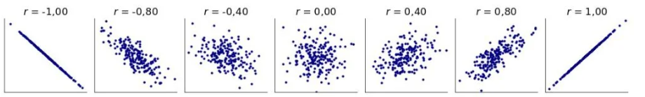
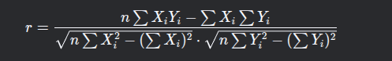
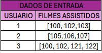
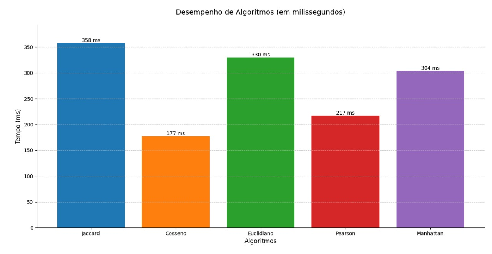

# Trabalho 2 - AEDS
## Recomendação de filmes

<div align="center">
    
    
    
    
    
    
</div>

## ⚠️ IMPORTANTE!

Para rodar o programa, é necessário ter os arquivos `ratings.csv` e `movies.csv` dentro de uma pasta chamada `/kaggle-data`, que fica localizada na raiz do projeto. Devido aos limites de armazenamento do GitHub, esses arquivos devem ser baixados separadamente pelo link abaixo:

[Base De Dados](https://www.kaggle.com/datasets/garymk/movielens-25m-dataset)

Além disso, no arquivo `datasets/explore.dat` deve estar definido, em cada linha, o id do usuário que receberá as recomendações de filmes.

As instruções mais detalhadas podem ser encontradas na seção <a href="#️-instruções-de-uso">Instruções de Uso</a> .

## 📑 Sumário

- [⚠️ IMPORTANTE!](#️-importante)
- [🔭 Introdução](#-introdução)
- [📝 Metodologia](#-metodologia)
  - [Pré-processamento](#pré-processamento)
  - [Processamento do Input](#processamento-do-input)
  - [Métodos de recomendação](#métodos-de-recomendação)
    - [Distância Euclidiana](#distância-euclidiana)
    - [Correlação de Pearson](#correlação-de-pearson)
    - [Jaccard](#jaccard)
    - [Manhattan](#manhattan)
    - [Cosseno](#similaridade-de-cosseno)
    - [Geração de Recomendações](#geração-de-recomendações)
  - [MinHash + LSH + Multithreading](#minhash--lsh--multithreading)
- [⏳️ Otimizações](#️-otimizações)
- [⚙️ Fluxo do Programa](#️-fluxo-do-programa)
- [📚️ Bibliotecas](#️-bibliotecas)
- [📂 Estrutura do Projeto](#-estrutura-do-projeto)
- [💻️ Classes, funções e configurações](#️-classes-funções-e-configurações)
- [🧪 Ambiente de Testes](#-ambiente-de-testes)
- [🏁 Conclusão](#-conclusão)
- [⬇️ Instruções de Uso](#️-instruções-de-uso)
- [✉️ Contato](#️-contato)
- [📜 Referências](#-referências)

## 🔭 Introdução

Esse projeto foi desenvolvido como trabalho final da disciplina de Algoritmos e Estruturas de Dados I, ministrada por Michel Pires, do curso de Engenharia de Computação do CEFET-MG (Campus Divinópolis). O objetivo desse trabalho é gerar recomendações de filmes para usuários específicos com base em um banco de dados público de filmes, que possui mais de 25 milhões de registros, contendo identificadores para os usuários e filmes, suas avaliações e o momento em que o registro foi feito.

Nesse estudo, foi utilizada a base de dados gratuita "MovieLens 25M", que disponibiliza dados das avaliações de mais de 160 mil usuários em mais de 62 mil filmes. Esses dados foram coletados pelo serviço MovieLens entre 1995 e 2019, tendo o conjunto de dados gerado em 21 de novembro de 2019. Os arquivos usados no desenvolvimento dessa aplicação foram: 

- `ratings.csv`: Arquivo que contém as avaliações dos usuários sobre determinado filme, tendo em cada linha o id do usuário, o id do filme, a nota do usuário nesse filme e o momento em que o registro foi feito (timestamp). O timestamp não foi incluido nesse estudo, já que não apresenta relevância na hora de recomendar os filmes para os usuários.

- `movies.csv`: Arquivo que traz informações sobre os filmes, como: id do filme no banco de dados, nome do filme e os gêneros dele.

Dessa maneira, a partir dos dados fornecidos pelo serviço e por meio da similaridade de cossenos, que permite relacionar as avaliações para encontrar usuários semelhantes de forma rápida, foi construido esse algoritmo de recomendação de filmes. Os detalhes de implementação e execução serão detalhados ao longo dessa documentação.

<p align="right">(<a href="#-sumário">voltar ao topo</a>)</p>

## 📝 Metodologia

Nesta etapa da documentação, explicaremos a linha de raciocínio utilizada para pensar as funcionalidades e decisões desse programa.

### Pré-processamento

#### Primeira abordagem

Para essa primeira parte, tentamos primeiro fazer uma leitura mais simples utilizando ```std::ifstream, std::getline, std::vector```, sem visar o desempenho do programa. Com essa abordagem inicial, foi possível obter um resultado médio de 75-80 segundos para pré-processar o dados do arquivo `ratings.csv`.

[Uma versão anterior da função que lida com esses dados pode ser encontrada nesse link](https://github.com/arthur-lage/movie-recommender/commit/303c64bf38c0b991bd4b02f4f14d6b8a00441137#diff-a6be4517d1cc29d972f91468e0137d1ba8455764b0176ff894a05fd4b4e07935R39-L41)

O arquivo era percorrido duas vezes: uma vez para descobrir a quantidade de avaliações feitas por um usuário e a quantidade de avaliações de um filme, e a outra pra ler os dados do filme e salvar numa estrutura de dados.
Após isso, essa estrutura era percorrida e os dados eram escritos no arquivo "input.dat".

Entretanto, essa abordagem, por ler o arquivo mais de uma vez, e salvar os dados de forma custosa, tornava o algoritmo muito demorado.

Por isso, decidimos tentar de outra maneira, com o objetivo de tornar o programa mais rápido.

#### Segunda abordagem

Assim, na segunda abordagem, ao invés de usar _ifstream_, usamos agora o FILE* da linguagem C, que apesar de ter uma implementação menos simples, permite com que lidemos com o arquivo de forma bem mais rápida. Além disso, utilizamos vetores de char ao invés de strings, e funções do C, como _strlen_, _strtol_, _strtof_, que tem um desempenho bem maior que as funções de string do C++.

Outra mudança importante foi substituir os vetores por estruturas que permitissem acesso mais rápido, como _unordered_map_ e _unordered_set_, além de facilitarem a verificação de que os seus registros são únicos.

[Versão dessa função](https://github.com/arthur-lage/movie-recommender/blob/2d7e87200a712fd513e8bd70e9829c681560a816/src/input_preprocessor.cpp#L43)

#### Abordagem final

Com o fito de obter a melhor performance possível, fizemos algumas substituições principais nessa parte do programa:

Utilizamos algumas funções customizadas para a conversão de strings para int e float, o que permite uma transformação mais rápida com menos overhead. Além de elaborarmos leitura e escrita com buffer, para que ao invés de ler uma linha por vez, essa leitura seria efetuada em blocos, diminuindo o número de operações em disco, o que demanda mais tempo.

Outra substituição feita foi reservar uma quantidade suficiente de memória para armazenar todos os usuários e filmes, evitando que o programa precise gastar tempo realocando memória. Usamos também estruturas para salvar e comparar dados para fazer os filtros, para evitar percorrer o arquivo mais de uma vez.

Além de que na [Linha 150](https://github.com/arthur-lage/movie-recommender/blob/f878c0861f5f62adb5a1959ee6716943b371a155/src/data_preprocessor.cpp#L150) foi feito um ajuste no alinhamento da memória. Os novos processadores conseguem operar memória de maneira mais eficiente quando os dados estão alinhados, e por isso, a falta de alinhamento no acesso pode causar penalidades na performance. Por isso é feito um ajuste de 64 bytes.

[Versão final do código](https://github.com/arthur-lage/movie-recommender/blob/f878c0861f5f62adb5a1959ee6716943b371a155/src/data_preprocessor.cpp#L18)

### Processamento do Input

Nessa parte falaremos sobre a implementação da parte responsável por processar o input (dados pré-processados).

O processamento é feito através da classe `src/input_processor.cpp`, e ele funciona fazendo a leitura do arquivo `datasets/input.dat`, gerado na parte do pré-processamento de dados. O código então lê as informações no formato:

```
user1 movie1:rating1 movie2:rating2 movie3:rating3
user2 movie4:rating4 movie5:rating5 movie6:rating6
```

Captura as informações desejadas, salvando-as em estruturas de dados próprias de cada thread (já que usamos paralelismo nessa parte). Em fim, ao fim do processamento, juntamos os dados de cada thread em uma só, do tipo personalizado `UsersAndMoviesData`. Esse será usado posteriormente para gerar as sugestões de filmes.

Elementos essenciais nessa etapa foram [Multithreading](#paralelização-multithreading) e [Mapeamento de Memória](#mapeamento-de-memória-de-arquivos), que permitiram uma grande redução no tempo de execução. O mapeamento de memória evita, ao carregar o arquivo para a memória, que muitos acessos em disco sejam feitos, pois demandam muito tempo para serem executados em grandes quantidades. Além desse fator, o multithreading permite que vários usuários sejam processados ao mesmo tempo, ao invés de lidar com um de cada vez. Isso permitiu que reduzíssimos o tempo de execução de 1955 ms, para em média 270ms.

<p align="right">(<a href="#-sumário">voltar ao topo</a>)</p>

### Métodos de recomendação

Para esse projeto, testamos diferentes métodos de gerar recomendações, com o objetivo de encontrar um que possuísse melhor desempenho para o programa.
Foram testadas as seguintes estratégias:

- **Distância euclidiana** 
- **Similaridade de Cossenos**
- **Correlação de Pearson**
- **Jaccard**
- **Manhattan**
- **MinHash + LSH + Multithreading**

Abaixo está uma breve descrição sobre esses métodos, e a performance média que obtivemos nos testes.

#### Distância euclidiana

Esse método funciona da seguinte maneira:

- 1. Compara um usuário desejado com os outros com base na nota de seus filmes assistidos em comum.
- 2. Avalia quais são os usuários com notas mais similares para esses filmes (Nesse projeto, são utilizados os 10 usuários mais parecidos).
- 3. Recomenda para o usuário alvo os filmes que os usuários similares já assistiram e deram notas altas.

Exemplo: 


Para gerar recomendações para o usuário 1:

- 1. Verifica quais usuários assistiram filmes em comum com ele.
- 2. Como o usuário 2 não possui filmes em comum com o usuário 1, ele é ignorado.
- 3. O usuário 3 possui 2 filmes em comum com o usuário 1 (10 e 12).
- 4. É calculada a distância euclidiana com a fórmula para os usuários em comum:


- 5. Verifica-se quais foram os usuários com menor distância (maior similaridade).
- 6. Calcula-se um peso, que é inversamente proporcional à distância: (1.0 / (1.0 + distancia)).
- 7. Agora para cada filme não assistido, é calculada uma média ponderada, utilizando o peso e a nota dos filmes não assistidos ainda.
- 8. Essa média é uma predição da nota que o usuário alvo poderia dar para o filme.
- 9. São selecionados os top 10 filmes com maior média, sendo esses os filmes recomendados para o usuário alvo.

Média de tempo para gerar recomendações para um usuário com esse método (10 testes para os mesmos usuários aleatórios): 330.28 milisegundos.

<p align="right">(<a href="#-sumário">voltar ao topo</a>)</p>

#### Correlação de Pearson

Retorno: entre -1 e 1. Quanto mais perto de 0 pior(mais desperso). Quanto mais próximo de 1 ou -1, melhor (mais concentrado).


Considerando "r" como o resultado da relação, tem-se: <br>
-r = |±1| → relação linear perfeita;<br>
-r = |±0,70| → relação linear forte;<br>
-r = |±0,50| → relação linear moderada;<br>
-r = |±0,30| → relação linear fraca;<br>
-r = 0 → ausência de relação linear.

Como funciona o cálculo: raiz da soma dos produtos dos desvios dividida pelo produto dos desvios padrão.
 <br>
TEMPO: Person levou em média 617,6 ms para gerar 1 recomendação

<p align="right">(<a href="#-sumário">voltar ao topo</a>)</p>

#### Jaccard

A Similaridade de Jaccard é uma medida estatística que calcula a similaridade entre dois conjuntos, com base na interseção e na união desses conjuntos. Essa métrica é definida como o tamanho da interseção dividido pelo tamanho da união dos conjuntos. Em outras palavras, a Similaridade de Jaccard mede a proporção de elementos comuns entre os conjuntos em relação ao total de elementos presentes nos conjuntos.

- Formula

<div align="center" style="font-size: 24px; font-family: Arial, sans-serif;">
  <b>J(A, B) = |A ∩ B| / |A ∪ B|</b>
</div>

Onde: 
 - A∩B = elementos em comum entre A e B;
 - A∪B= todos os elementos únicos de A e B juntos.

##### Funcionamento

 1° Comparação entre usuários:
  - Compara um usuário desejado com os outros com base nos filmes assistidos em comum.
  - Avalia quais são os usuários com perfis mais similares

2° Gerar as recomendações:
 - Recomenda para o usuário alvo os filmes que os usuários similares já assistiram, mas que ele ainda não viu.
 - Prioriza filmes que aparecem com mais frequência entre os usuários similares.

##### Exemplo:



Processamento para o Usuário 1

 - *1°: Encontra usuários com filmes em comum:*

   - Usuário 3 tem 2 filmes em comum com o Usuário 1 (filmes100 e 102).
   - Usuário 2 não tem filmes em comum e é ignorado.

- *2°:  Calcula a similaridade de Jaccard:*

  - Interseção (filmes em comum): 2 (100 e 102)
  - União (total de filmes únicos): 5 (100, 102, 103, 121, 122)
  - Similaridade = 2/5 = 0.4

- *3° Gerar as recomendações:*

  - Filmes do Usuário 3 não vistos pelo Usuário 1: {121, 212}
  - Como só tem um usuário similar (Usuário 3), ambos os filmes são recomendados com peso 1.

<p align="right">(<a href="#-sumário">voltar ao topo</a>)</p>

#### Manhattan

A distância de Manhattan é uma métrica usada para determinar a distância entre dois pontos em um caminho semelhante a uma grade. Ela mede a soma das diferenças absolutas entre as coordenadas dos pontos.
Matematicamente, a distância de Manhattan entre dois pontos em um espaço n-dimensional é a soma das diferenças absolutas de suas coordenadas cartesianas.

##### Propriedades 
A distância de Manhattan satisfaz todas as quatro condições necessárias para uma função de distância em um espaço métrico:

- 1. *Não negatividade:* A distância entre dois pontos quaisquer é sempre não negativa. d(x, y) ≥ 0 para todos os x e y.
- 2. *Identidade de indiscerníveis:* A distância entre um ponto e ele mesmo é zero, e se a distância entre dois pontos for zero, eles são o mesmo ponto. d(x, y) = 0 se e somente se x = y.
- 3. *Simetria:* A distância do ponto A ao ponto B é a mesma que a distância de B a A. d(x, y) = d(y, x) para todos os x e y.
- 4. *Desigualdade triangular:* A distância entre dois pontos é sempre menor ou igual à soma das distâncias entre esses pontos e um terceiro ponto. d(x, z) ≤ d(x, y) + d(y, z) para todos os x, y e z.

Diferentemente da distância de cosseno, que não satisfaz a desigualdade triangular, a adesão da distância de Manhattan a todas essas propriedades a torna útil em várias aplicações matemáticas e computacionais. Por exemplo:

- Em algoritmos de otimização, a desigualdade triangular pode ser usada para eliminar espaços de pesquisa com eficiência.
- Em estruturas de dados como árvores métricas, essas propriedades permitem pesquisas mais rápidas do vizinho mais próximo.
- No machine learning, os algoritmos que se baseiam em métricas de distância (como k-nearest neighbors) podem aproveitar essas propriedades para obter garantias teóricas e implementações eficientes.

<p align="right">(<a href="#-sumário">voltar ao topo</a>)</p>
  
##### Como código está implementado

O arquivo recommender_manhattan é onde o algoritmo manhattan está implementado.
- **read_explore_file**: Lê o arquivo datasets/explore.dat para identificar os usuários que devem receber recomendações e armazena os IDs no unordered_set<int> usersToRecommend.
- **computeDistance**: Calcula a distância(similiaridade) de Manhattan entre dois usuários, fazendo a soma das diferenças absolutas das notas dadas aos mesmos filmes (avaliados por ambos). Quando não há filmes em comum, retorna INFINITY (sem similaridade).
- **findSimilarUsers**: Recebe um usuário-alvo e os dados de avaliações de todos os usuários, com isso compara o usuário-alvo com todos os outros, usando computeDistance e depois ordena os usuários com a menor distância retornando os mais proximos.
- **getRecommendations**: Gera recomendações de filmes para o usuário-alvo, baseado nos similares. Para cada filme que o usuário-alvo ainda não viu, acumula uma média ponderada das notas dos usuários similares. Peso = 1 / (1 + distância) → mais próximo = maior peso. Retorna uma lista ordenada com os filmes recomendados e suas pontuações estimadas.
- **generateRecommendations**: Principal função que é responsavel por lê os usuários a serem recomendados, onde para cada usuário encontra usuários similares (findSimilarUsers), gera as recomendações (getRecommendations) e exibe elas medindo o tempo de execução de cada recomendação e calcula o tempo médio no final.

#### Similaridade de Cosseno

A **similaridade de cosseno** é uma medida utilizada para avaliar o quão parecidos são dois vetores em um espaço de alta dimensão.  
No contexto deste projeto, cada vetor representa um usuário, e cada dimensão representa a avaliação dada a um filme.  

Essa medida é muito usada em **mineração de dados**, **sistemas de recomendação** e **processamento de linguagem natural**, por ser eficaz na comparação de perfis mesmo que eles tenham magnitudes diferentes.  


##### Como funciona?

Para entender a similaridade de cosseno, é importante entender dois conceitos:

- **Produto escalar**: soma da multiplicação dos elementos correspondentes de dois vetores.  
- **Norma (ou magnitude)**: comprimento do vetor, calculado com o teorema de Pitágoras.  

A similaridade de cosseno é calculada da seguinte forma:

    similaridade = (A ⋅ B) / (||A|| ⋅ ||B||)


Onde:  

- `A ⋅ B` é o **produto escalar** dos vetores (ex: notas dos usuários).  
- `||A||` e `||B||` são as **normas** de A e B, ou seja, o comprimento dos vetores.  

Essa fórmula nos dá o **cosseno do ângulo entre os vetores**.  
Quanto mais próximos os vetores estiverem (em direção), maior a similaridade.


##### Intervalo de Valores

A similaridade de cosseno varia entre:

- **1** → vetores idênticos (gostos idênticos)  
- **0** → vetores ortogonais (sem relação)  
- **-1** → vetores com direções opostas *(não ocorre aqui, pois não há notas negativas)*  


##### Aplicação no Projeto

No seu sistema de recomendação:

- Cada **usuário é representado por um vetor de notas** (somente para os filmes que ele avaliou).  
- A similaridade de cosseno é usada para **comparar o vetor do usuário-alvo com os vetores de todos os outros usuários**.  
- Apenas os usuários com **similaridade maior que 0.2** são considerados **vizinhos relevantes**.  
- As **recomendações são geradas com base nos filmes bem avaliados por esses usuários semelhantes**, mas que o usuário-alvo ainda não viu.  


<p align="right">(<a href="#-sumário">voltar ao topo</a>)</p>

### Comparativo de Performace de Recomendação

Analisando apenas o tempo que o algoritmo gasta, em média, para gerar uma única recomendação (desconsiderando tempos de pré-processamento, outros tipos de tratamento, etc) tem-se:



#### 🔍 Análise dos Resultados  

##### **Cosseno (Mais rápido - 177 ms) - Algoritmo Escolhido**  

- **Motivo da velocidade**:  
  - Baseado em produto escalar e normas, operações altamente otimizadas.  
  - Não requer cálculo de raízes quadradas.  
- **Hardware**: Operações vetorizadas se beneficiam de paralelismo(posteriormente aplicado).  

##### **Pearson (217 ms)**  

- **Semelhança com Cosseno**, mas normalizado pela média.  
- **Leve custo adicional** devido ao cálculo das médias.  

##### **Manhattan (304 ms)**  

- **Soma de diferenças absolutas**, sem operações complexas.  
- **Mais lento que Cosseno/Pearson** devido a loops sequenciais.  

##### **Euclidiano (330 ms)**  

- **Envolve raiz quadrada**, o que aumenta o tempo.  

##### **Jaccard (Mais lento - 358 ms)**  

- **Operações sobre conjuntos** (interseção/uniao), menos eficientes.  
- **Dimensionalidade**: algoritmos como Jaccard sofrem com alta dimensionalidade.  


### MinHash + LSH + Multithreading

Foi testado o uso de MinHash + LSH para otimizar o cálculo de similaridade ao agrupar usuários 80% semelhantes e fornecer uma única recomendação para o conjunto, enquanto para usuários que não se encaixassem nessa métrica receberiam as recomendações individuais. Entretanto, em razão da esparcidade dos dados e da alta dimensionalidade do conjunto, o uso de MinHash + LSH + Multithreading se provou 50% pior que o uso apenas do cosseno (poucos usuários se provavam semelhantes, e o custo do cálculo dessa semelhança não compensava a otimização). Com a diminuição do threshold (porcentagem que define usuários como semelhantes) e aumento das bandas (para provocar mais colisões e, assim, encontrar mais users semelhantes) foi possível encontrar mais usuários semelhantes, em média, mas o tempo de execução piorou. Por essas razões, a combinação de MinHash + LSH + Multithreading se provou muito custosa e foi descontinuada.

### Geração de Recomendações

A etapa principal do projeto é a geração de recomendações. Essa parte acontece dentro da classe Recommender, nesse método:
```
void generateRecommendations(const UsersAndMoviesData& usersAndMovies, const MoviesData& movies);
```
 Esse método, utilizamos as avaliações feitas pelos usuários para prever quais filmes eles podem gostar, com base em gostos semelhantes de outros usuários.


###  Etapas internas do processo

#### 1.  Leitura dos usuários-alvo (`explore.dat`)

* O sistema começa abrindo o arquivo datasets/explore.dat, que possui uma lista de IDs de usuários, um por linha.
* Para cada linha do arquivo, o ID do usuário é guardado em um conjunto não ordenado chamado usersToRecommend
* Esses são exatamente os usuários para os quais queremos criar recomendações.


#### 2. Paralelismo com fila de tarefas

* Criamos uma fila chamada userQueue, que recebe todos esses IDs de usuário.
* Para agilizar o processo, o sistema inicia várias threads (o número delas depende da quantidade de CPUs disponíveis) para trabalhar em paralelo.
* Cada thread executa uma função chamada worker(), que faz o seguinte:

  1. Puxa um usuário da fila (userQueue), usando um mutex para garantir que ninguém interfira ao mesmo tempo.
  2. Gera recomendações para esse usuário.
  3. Escreve os resultados de forma segura e concorrente usando `mutexes`.


#### 3. Cálculo de similaridade entre usuários

Dentro da thread:

* O sistema utiliza a função `computeCosineSimilarity(user1, user2, usersAndMovies)` para comparar o usuário que estamos analisando com todos os outros usuários cadastrados.
* Essa função percorre os filmes que ambos os usuários avaliaram e realiza esse cálculo da similaridade:

$$
\text{similaridade} = \frac{\sum (nota_1 \cdot nota_2)}{\|user_1\| \cdot \|user_2\|}
$$

* As normas dos vetores de avaliações já foram calculadas previamente com a função `precomputeUserNorms()`), o que ajuda a deixar o processo mais rápido.
* Somente os usuários cuja similaridade for maior que 0,2 são considerados relevantes.
* O sistema mantém uma lista com até `K` usuários mais parecidos (no padrão, K é igual a 15), usando a técnica `partial_sort` para organizar esses dados.


#### 4.  Previsão de notas para filmes não vistos

* Para cada filme avaliado pelos usuários similares e que o usuário-alvo ainda não assistiu, o sistema calcula uma nota prevista:

$$
\text{nota prevista (filme)} = \frac{\sum (\text{nota do vizinho} \cdot \text{similaridade})}{\sum (\text{similaridade})}
$$

* Isso significa que:

  * Se vários usuários próximos deram uma avaliação alta a um filme que o usuário-alvo ainda não viu,
  * E esses usuários têm uma alta similaridade com ele,
  * E esses usuários têm uma alta similaridade com ele.

* Os dados são armazenados num `std::unordered_map<movie_id_t, std::pair<double, double>> predictions`, onde:

  * `first`: somatório ponderado das notas.
  * `second`: somatório das similaridades.


#### 5.  Seleção dos melhores filmes

* O sistema percorre o mapa `predictions`, calcula `nota prevista = first / second`, e armazena os pares `(movie_id, score)` em um `std::vector`.
* Esse vetor é ordenado de forma decrescente pelos scores.
* São selecionados os `NUMBER_OF_RECOMMENDATIONS_PER_USER` primeiros (padrão = 5).


#### 6.  Escrita formatada das recomendações

* Para cada recomendação, o sistema usa `MoviesData` para obter o título real do filme.
* A saída formatada é semelhante a:

```
Recommendations for user 12345:

The Matrix (1999) (Score: 4.98)
Fight Club (1999) (Score: 4.85)
The Godfather (1972) (Score: 4.80)
...
```

* Esse conteúdo é escrito em buffer com `OutputManager.write(...)`.
* Ao final, todas as threads finalizam, e o buffer é `flush()` no arquivo `outcome/output.txt`.


###  Estruturas usadas

* `UsersAndMoviesData`: mapeia usuário → conjunto de (filme, nota).
* `MoviesData`: mapeia movie\_id → nome do filme.
* `unordered_map<user_id_t, double> userNorms`: armazena a norma dos vetores dos usuários.
* `queue`, `mutex`, `condition_variable`: controle concorrente de usuários sendo processados.
* `OutputManager`: escrita segura e eficiente em disco.


###  Por que esse método?

* Escalável: processa milhões de avaliações com múltiplas threads.
* Colaborativo: baseia-se em usuários reais com gostos parecidos.
* Flexível: o limiar de similaridade e número de vizinhos são facilmente configuráveis.
* Qualitativo: recomenda apenas filmes ainda não vistos pelo usuário.

<p align="right">(<a href="#-sumário">voltar ao topo</a>)</p>

## ⏳️ Otimizações

Como o desempenho do programa foi um dos critérios mais relevantes na avaliação do trabalho, tornou-se essencial otimizar o máximo possível o programa.
Nesta seção, descreveremos os pontos chaves que levaram o tempo de execução médio do programa de quase 100 segundos para 3 segundos, uma redução de 97%, ou um ganho de performance de 32 vezes.

### Substituição de funções do C++ pelas de C

Devido ao overhead de algumas das funcionalidades do C++, foi possível notar uma grande perda de desempenho quando utilizados: ```std::string, std::ofstream, std::ifstream, std::getline()```. Essas estruturas e funções, por implementarem muitas verificações e recursos que não foram utilizadas em nosso projeto, causaram uma redução na performance do programa, já que o processador precisa executar mais operações, que nesse caso não trazem benefícios.

Por isso, decidimos implementar as leituras e escritas de arquivo em C, usando ```FILE*, char*, fopen(), fread(), fwrite(), strtok(), strchr()```, que trouxeram uma melhora significativa no tempo de pré-processamento de dados.

### Bufferização na leitura e escrita de arquivo

Ao invés de ler os dados um por um ou escrever cada dado separadamente no arquivo pré-processado ou de recomendações, decidimos utilizar a bufferização desses dados. Essa prática consiste em acumular os dados num buffer (uma varíavel) de um determinado tamanho, e quando esse tamanho é atingido, o programa realiza o processamento ou a escrita esses dados. Essa abordagem traz benefícios para performance, uma vez que as operações de I/O (entrada e saída) em disco custam caro para o processador, e executá-las para dezenas de milhares de dados obrigam o computador a fazer muitos acessos ao disco. Usando a bufferização, é possível reduzir bastante a quantidade de operações, diminuindo consideravelmente o tempo gasto para ler e escrever os arquivos.

### Paralelização (Multithreading)

O uso de multithreading permite que o programa realize múltiplas tarefas ao mesmo tempo, de forma a aproveitar melhor os recursos do processador. Essa estratégia faz com que o programa separe as tarefas para núcleos diferentes do processador, tornando assim possível que essas sejam feitas simultâneamente. Isso foi de extrema importância para o cálculo das recomendações, umas vez que, sem o uso de paralelismo, o programa demorava em média 8 segundos para gerar as recomendações de 50 usuários. Porém, com a implementação dessa técnica, foi possível reduzir esse tempo para menos de 1800ms, já que partes diferentes do processador ficam responsáveis pelos cálculos, ao invés do programa executar linearmente cada um deles.

### Recriar funções de conversão de string para int ou float

Outra medida que ajudou a reduzir bastante o tempo de execução do projeto foi criar novas funções que possibilitassem a conversão mais rápida de dados. As funçoes ```atoi(), atof()``` do C fazem a conversão de strings para inteiros e decimais, respectivamente. Entretanto, essas funções fazem muitas operações além da conversão de dados, o que desacelera o processo. Assim, recriando essa funções para fazer as conversões de forma mais simples, as quais podem ser encontradas em `include/utils.hpp`, foi possível obter um grande aumento de desempenho, reduzindo o tempo de pré-processamento de 4500ms em média para 1000ms. Além disso, essa decisão ajudou a reduzir em cerca de 100ms o tempo de leitura e processamento do arquivo "input.dat".

### Mapeamento de Memória de arquivos

O **mmap** (mapeamento de memória) é uma técnica em C/C++ que mapeia um arquivo diretamente na memória do processo, eliminando a necessidade de leituras e escritas repetitivas por meio de chamadas de sistema tradicionais como `read()` e `write()`. Ao usar `mmap`, o sistema operacional gerencia o carregamento sob demanda dos dados do arquivo em páginas de memória, permitindo acesso eficiente como se fossem arrays em RAM. Isso é especialmente vantajoso para processamento de **arquivos grandes**, pois evita cópias desnecessárias entre buffers do kernel e espaço de usuário, reduzindo sobrecarga e melhorando significativamente a performance. Além disso, o `mmap` permite operações de acesso aleatório eficientes e pode tirar proveito da paginação virtual do sistema, carregando apenas as partes do arquivo que são realmente acessadas, economizando recursos de I/O e memória.

## ⚙️ Fluxo do Programa


O programa funciona seguindo uma sequência bem organizada de etapas, começando pelo pré-processamento dos dados até chegar às recomendações personalizadas para cada usuário. O fluxograma mostra essa sequência de forma clara:


### 1. main.cpp  
O arquivo principal é quem coordena toda a execução do sistema. Ele cria os objetos necessários e chama os métodos que cuidam de cada fase do processo.  


### 2. DataPreprocessor  
É a classe responsável por ler o arquivo `ratings.csv`, que vem da base MovieLens, e fazer o pré-processamento dos dados.  

Dentro dessa classe, há uma função chamada `process_ratings()`:

- Ela começa lendo o arquivo CSV original, que contém milhões de avaliações.  
- Depois, filtra apenas os usuários e filmes que têm pelo menos 50 avaliações.  
- Também remove registros duplicados e quaisquer inconsistências nos dados.  
- Por fim, gera um arquivo chamado `datasets/input.dat`, que será utilizado nas etapas seguintes do sistema.  


### 3. InputProcessor  
Esta é uma classe responsável por abrir o arquivo `input.dat`, que foi criado anteriormente, e carregá-lo na memória para uso.  

A função `process_input(UsersAndMoviesData&)` lê todas as linhas do arquivo `input.dat` e constrói uma estrutura chamada `UsersAndMoviesData`.  
Essa estrutura armazena informações sobre todos os usuários e os filmes que eles avaliaram, junto com as notas atribuídas a cada um deles.  


### 4. MovieReader  
Faz a leitura do arquivo `movies.csv`, que contém os títulos dos filmes.  

A função `getMovies(MoviesData&)` mapeia cada identificador de filme (`movie_id`) para o título correspondente.  
Ela preenche a estrutura `MoviesData` com esses dados, organizando as informações de forma acessível para o restante do programa.  


### 5. Recommender  
Ela começa lendo o arquivo `datasets/explore.dat`, que contém os IDs dos usuários que irão receber as recomendações.  

- Depois, calcula a similaridade entre os usuários usando o método do cosseno.  
- Em seguida, identifica os K usuários mais semelhantes a cada usuário alvo.  
- Com base nisso, seleciona filmes que o usuário ainda não assistiu, mas que foram bem avaliados pelos usuários semelhantes.  
- Para cada usuário, gera até cinco recomendações, de acordo com o que está definido no arquivo `config.hpp`.  
- Por fim, grava todas as recomendações no arquivo `outcome/output.txt`.  


### 6. Arquivo de saída: outcome/output.txt  
O arquivo gerado ao final contém as sugestões personalizadas para cada usuário listado em `datasets/explore.dat`.  
Cada grupo de recomendações segue este formato:  

Recommendations for user <user_id>

<movie_title_1> (Score: <nota>)

<movie_title_2> (Score: <nota>)

<movie_title_3> (Score: <nota>)

<movie_title_4> (Score: <nota>)

<movie_title_5> (Score: <nota>)

<p align="right">(<a href="#-sumário">voltar ao topo</a>)</p>

## 📚️ Bibliotecas

Além das bibliotecas criadas para o projeto, foram utilizadas as seguintes bibliotecas padrão:

### Estruturas de Dados e Containers

- **`<unordered_map>`**  
  Mapa baseado em hash para armazenamento eficiente de pares chave-valor sem ordenação.

- **`<unordered_set>`**  
  Conjunto baseado em hash para elementos únicos com buscas rápidas.

- **`<vector>`**  
  Array dinâmico com alocação automática de memória.

- **`<queue>`**  
  Implementa estruturas FIFO (`queue`) e filas prioritárias (`priority_queue`).

### Manipulação de Strings e I/O

- **`<string>`**  
  Operações avançadas de manipulação de strings.

- **`<cstring>`**  
  Funções C-style para manipulação de strings (`strcpy`, `strcmp`).

- **`<iostream>`**  
  Fluxos padrão de entrada/saída (`cin`, `cout`).

- **`<fstream>`**  
  Leitura/escrita de arquivos (`ifstream`, `ofstream`).

- **`<sstream>`**  
  Tratamento de strings como fluxos (`stringstream`).

### Algoritmos e Utilitários

- **`<algorithm>`**  
  Funções genéricas para containers (`sort`, `find`, `transform`).

- **`<numeric>`**  
  Operações numéricas em containers (`accumulate`, `inner_product`).

- **`<random>`**  
  Geração de números aleatórios com diferentes distribuições.

### Matemática e Tipos Numéricos

- **`<cmath>`**  
  Funções matemáticas básicas (`sqrt`, `pow`, trigonométricas).

- **`<cstdint>`**  
  Tipos inteiros com tamanho fixo (`uint32_t`, `int64_t`).

### Concorrência e Sincronização

- **`<thread>`**  
  Criação e gerenciamento de threads.

- **`<mutex>`**  
  Mecanismos de exclusão mútua para thread-safety.

- **`<condition_variable>`**  
  Sincronização avançada entre threads.

- **`<atomic>`**  
  Operações atômicas para acesso seguro a variáveis compartilhadas.

### Tratamento de Erros
- **`<stdexcept>`**  
  Classes para exceções padrão (`runtime_error`, `invalid_argument`).

### Sistema e Baixo Nível

- **`<cstdio>`**  
  I/O estilo C (`printf`, `scanf`).

- **`<cstdlib>`**  
  Utilitários gerais (`atoi`, `rand`, `exit`).

- **`<sys/stat.h>`**  
  Verificação de atributos de arquivos (`stat`).

- **`<sys/mman.h>`**  
  Mapeamento de arquivos em memória (`mmap`).

- **`<fcntl.h>`**  
  Controle de arquivos em baixo nível (`open`, `O_RDONLY`).

- **`<unistd.h>`**  
  Chamadas POSIX (`read`, `write`, `sleep`).

- **`<cctype>`**  
  Classificação de caracteres (`isalpha`, `isdigit`).

<p align="right">(<a href="#-sumário">voltar ao topo</a>)</p>

## 📂 Estrutura do Projeto

Para esse projeto, utilizamos a seguinte estrutura:

```bash
movie-recommender/
│
├── datasets/                  # Pasta contendo arquivos de dados brutos
│   ├── explore.dat            # Arquivo de dados para exploração
│   └── input.dat              # Arquivo de dados de entrada
│
├── include/                   # Pasta com cabeçalhos (.hpp)
│   ├── config.hpp             # Configurações do sistema
│   ├── custom_types.hpp       # Tipos de dados customizados
│   ├── data_preprocessor.hpp  # Pré-processamento de dados
│   ├── file_handler.hpp       # Manipulação de arquivos
│   ├── input_processor.hpp    # Processamento de entrada
│   ├── movie_reader.hpp       # Leitura de dados de filmes
│   ├── output_manager.hpp     # Gerenciamento de saída
│   ├── recommender.hpp        # Lógica de recomendação
│   └── utils.hpp              # Utilitários diversos
│
├── kaggle-data/               # Dados obtidos do Kaggle
│   ├── movies.csv             # Informações de filmes
│   └── ratings.csv            # Avaliações de usuários
│
├── outcome/                   # Resultados gerados
│   └── output.txt             # Arquivo de saída com as recomendações
│
├── src/                       # Código fonte (.cpp)
│   ├── data_preprocessor.cpp  # Implementação do pré-processador
│   ├── file_handler.cpp       # Implementação do manipulador de arquivos (classe base)
│   ├── input_processor.cpp    # Implementação do processador dos dados pré-processados
│   ├── main.cpp               # Ponto de entrada do programa
│   ├── movie_reader.cpp       # Implementação do leitor de filmes
│   ├── output_manager.cpp     # Implementação do gerenciador de saída
│   ├── recommender.cpp        # Implementação do sistema de recomendação
│   └── utils.cpp              # Implementação de utilitários
│
├── .gitignore                 # Arquivo para ignorar no versionamento
├── Makefile                   # Script de compilação
├── pratica.pdf                # Instruções do trabalho
└── README.md                  # Documentação principal do projeto
```

**Estrutura e Arquivos do Sistema de Recomendação de Filmes**  

O projeto **movie-recommender** é organizado em pastas que separam os diferentes componentes do sistema, facilitando a manutenção e o desenvolvimento. A pasta **datasets/** contém arquivos essenciais para a funcionalidade principal do programa, como `explore.dat`, que descreve quais os usuários que receberão sugestões de filmes, e `input.dat`, que possui os dados filtrados e pré-processados.

Na pasta **include/**, estão os cabeçalhos (.hpp) que definem as estruturas e funções do sistema. O arquivo **config.hpp** guarda configurações globais, enquanto **custom_types.hpp** define tipos de dados personalizados para melhor organização. O pré-processamento de dados é tratado em **data_preprocessor.hpp**, e a classe base dos arquivos que usam arquivos está em **file_handler.hpp**. Já **input_processor.hpp** lida com a leitura e salvamento dos dados pré-processados, **movie_reader.hpp** concentra a leitura de informações sobre filmes, e **output_manager.hpp** controla a geração do arquivo de resultados. A lógica principal de recomendação está em **recommender.hpp**, e utilitários auxiliares são definidos em **utils.hpp**.  

Os dados externos, obtidos do Kaggle, estão em **kaggle-data/**, com **movies.csv** (metadados de filmes) e **ratings.csv** (avaliações de usuários), servindo como base para gerar as sugestões de filme. Os resultados gerados são salvos em **outcome/output.txt**, que contém as recomendações finais.  

A implementação das funcionalidades está na pasta **src/**, com arquivos como **data_preprocessor.cpp** (pré-processamento), **file_handler.cpp** (operações de arquivo), **input_processor.cpp** (processamento de dados pré-processados), e **main.cpp** (ponto de entrada). O coração do sistema, **recommender.cpp**, implementa os algoritmos de recomendação, enquanto **utils.cpp** fornece funções auxiliares.  

Arquivos como **Makefile** automatizam a compilação, **.gitignore** exclui arquivos desnecessários do versionamento, e **README.md** documenta o projeto. O **pratica.pdf** contém as instruções do trabalho, com a proposta do projeto. Essa estrutura modular garante clareza e facilidade de expansão para novas funcionalidades.

## 💻️ Classes, funções e configurações

Uma descrição sobre as partes essenciais do programa:

📁 **config.hpp**  
No arquivo `config.hpp`, você encontra algumas constantes globais que ajudam a definir como o sistema de recomendação funciona:  

- `MININUM_REVIEW_COUNT_PER_USER = 50`: essa é a quantidade mínima de avaliações que um usuário precisa ter para ser considerado no sistema.  
- `MININUM_REVIEW_COUNT_PER_MOVIE = 50`: essa é a quantidade mínima de avaliações que um filme deve ter para entrar na lista de considerados.  
- `NUMBER_OF_RECOMMENDATIONS_PER_USER = 5`: esse é o número de recomendações que o sistema gera para cada usuário.  

📁 **custom_types.hpp**  
Já no arquivo `custom_types.hpp`, estão definidas algumas estruturas e apelidos que o sistema usa o tempo todo:  

- `user_id_t` e `movie_id_t`: esses são apelidos para o tipo `int`, usados para tornar o código mais fácil de entender.  

### struct Rating  
Este trecho descreve alguns componentes relacionados à avaliação de filmes:  

- Uma estrutura que representa a avaliação de um filme, contendo dois campos: o ID do filme (`movie`) e a nota dada (`score`).  
- A sobrecarga do operador `==` para que as avaliações possam ser comparadas com base no ID do filme.  
- Uma estrutura de hash personalizada criada para permitir o uso de `Rating` em um conjunto não ordenado (`unordered_set`).  

Além disso, há dois tipos de dados definidos:  

- `MoviesData`: um mapa que relaciona o ID do filme (`movie_id_t`) aos seus títulos, que são `strings`.  
- `UsersAndMoviesData`: um mapa que associa o ID do usuário (`user_id_t`) a um conjunto de avaliações (`Rating`).  

📁 **file_handler.hpp / file_handler.cpp**  
Aqui encontramos a classe básica responsável por lidar com arquivos:  

### Classe FileHandler  
- Possui um atributo `FILE*` chamado `file`, que é o ponteiro para o arquivo.  
- Seu construtor abre o arquivo.  
- O destrutor fecha o arquivo automaticamente ao final.  
- Há também o método `close()`, que permite encerrar a leitura do arquivo manualmente.  

📁 **data_preprocessor.hpp / data_preprocessor.cpp**  
Temos a parte que cuida do pré-processamento dos dados:  

### Classe DataPreprocessor (que herda de FileHandler)  
- O construtor recebe o nome do arquivo e o modo de abertura.  
- O método `process_ratings()`:  
  - Lê o arquivo `ratings.csv` usando um buffer otimizado para melhorar o desempenho.  
  - Filtra apenas os usuários que têm pelo menos 50 avaliações e os filmes com pelo menos 50 avaliações.  
  - Remove linhas inválidas e gera um arquivo chamado `input.dat` nesse formato:  
    ```
    user_id item1:rating1 item2:rating2 ...
    ```  

📁 **input_processor.hpp / input_processor.cpp**  
Nesse arquivo, está a classe responsável por ler os dados que já foram pré-processados:  

### Classe InputProcessor  
- `process_input(UsersAndMoviesData&)`:  
  - Utiliza `mmap` para ler o arquivo `input.dat` de forma rápida.  
  - Divide o arquivo em partes para serem processadas por diferentes threads.  
  - Preenche o mapa `UsersAndMoviesData` com as avaliações feitas por cada usuário.  

📁 **movie_reader.hpp / movie_reader.cpp**  
Aqui temos o leitor que busca os nomes dos filmes:  

### Classe MovieReader (que herda de FileHandler)  
- `getMovies(MoviesData&)`:  
  - Lê o arquivo `movies.csv`.  
  - Associa cada ID de filme ao seu título correspondente.  

📁 **output_manager.hpp / output_manager.cpp**  
É onde ocorre a escrita do resultado final:  

### Classe OutputManager  
- `openFile()` / `openInOutcome()`: abre arquivos para escrita.  
- `write(const char*, size_t)`: escreve os dados no buffer.  
- `flush()`: envia o conteúdo do buffer para o disco.  
- `closeFile()`: fecha o arquivo.  
- `getBufferSize()`, `isFileOpen()`: funções auxiliares para verificar o estado.  

📁 **recommender.hpp / recommender.cpp**  
Encontramos a parte principal do sistema de recomendação:  

### Classe Recommender  
- `generateRecommendations(const UsersAndMoviesData&, const MoviesData&)`:  
  - Carrega os usuários do arquivo `explore.dat`.  
  - Para cada usuário:  
    - Identifica os 15 usuários mais semelhantes, com uma similaridade do cosseno maior que 0,2.  
    - Considera os filmes bem avaliados por esses usuários, que o usuário alvo ainda não viu.  
    - Calcula uma média ponderada dessas avaliações, levando em conta a similaridade.  
    - Seleciona os 5 melhores filmes e grava no arquivo `output.dat`.  
    - Utiliza threads para processar vários usuários ao mesmo tempo, acelerando o processamento.  

- `precomputeUserNorms()`: calcula e guarda a norma (ou seja, o comprimento) de cada vetor de avaliações dos usuários.  
- `computeCosineSimilarity(u1, u2, data)`: calcula e devolve a similaridade do cosseno entre dois usuários com base nos dados disponíveis.  

📁 **utils.hpp**  
Aqui estão algumas funções auxiliares:  

- `fast_atoi`: converte rapidamente uma string de caracteres para um número inteiro.  
- `fast_atof`: faz a conversão rápida de uma string de caracteres para um número `float`.  

📁 **main.cpp**  
No arquivo `main.cpp`, está o controle principal de como o programa funciona:  

Primeiro, ele cria um objeto `DataPreprocessor` e processa o arquivo `ratings.csv`.  
Depois, cria um `InputProcessor` para carregar o arquivo `input.dat` na estrutura `usersAndMovies`.  
Em seguida, lê o arquivo `movies.csv` usando o `MovieReader` e preenche a lista de filmes.  
Após isso, instancia um `Recommender` e chama o método `generateRecommendations` para gerar as recomendações.  
Por fim, mede quanto tempo cada etapa levou e exibe essas informações no terminal.  


<p align="right">(<a href="#-sumário">voltar ao topo</a>)</p>

## 🧪 Ambiente de Testes

Os testes do algoritmo foram feitos no seguinte dispositivo:

```
Modelo: Acer Nitro ANV15-51;
CPU: 13th Gen Intel® Core™ i5-13420H × 12;
Memória: 8.0 GiB
Disco: SSD 512 GB
Sistema Operacional: Ubuntu 24.04.1 LTS 
```

Além disso, foram utilizadas as ferramentas:

```
G++ (Compilador C++): gcc version 13.3.0 (Ubuntu 13.3.0-6ubuntu2~24.04)
Makefile: GNU Make 4.3 Built for x86_64-pc-linux-gnu
```

<p align="right">(<a href="#-sumário">voltar ao topo</a>)</p>

## 🏁 Conclusão

O desenvolvimento e a melhoria do sistema de recomendação de filmes em C++, como mostramos neste trabalho, mostram o quão eficaz e flexível é usar filtragem colaborativa baseada em similaridade para resolver problemas complexos com grandes volumes de dados. As otimizações que implementamos, como o uso de multithreading, mapeamento de memória (mmap) e a troca de funções mais lentas da STL por versões mais rápidas em C, trouxeram melhorias importantes no desempenho e na eficiência do sistema.

Optar pela similaridade de cosseno como método principal de recomendação reforça a confiabilidade da solução, pois ela oferece resultados consistentes mesmo em situações com muita esparsidade e alta dimensionalidade, como na base MovieLens 25M. Além disso, o uso de estruturas eficientes, como unordered_map, buffers manuais e pré-cálculos de normas, ajudou a reduzir bastante o tempo de processamento, tornando o sistema mais escalável e viável para uso em situações reais.

Os testes que realizamos mostraram que, usando várias threads e processamento simultâneo, conseguimos gerar recomendações para dezenas de usuários em apenas alguns segundos. Isso confirmou que a arquitetura que propusemos é eficiente. O projeto também revelou que com a combinação de algoritmos, estruturas de dados e pequenas otimizações, é possível obter resultados muito bons em C++, mesmo com conjuntos de dados enormes.

Esse trabalho abre espaço para futuras melhorias, como a inclusão de métodos híbridos, o uso de modelos de aprendizado de máquina e a adaptação para ambientes distribuídos. Com o desenvolvimento contínuo dessa base, podemos avançar na criação de sistemas de recomendação cada vez mais rápidos, precisos e capazes de atender às necessidades atuais da ciência de dados.

## ⬇️ Instruções de Uso

Instruções para baixar e executar o projeto em um ambiente Ubuntu:

- 1. Dependências do projeto

```bash
# Primeiro, é recomendado atualizar os pacotes do sistema
sudo apt update -y
sudo apt upgrade -y

# Em seguida, instale as ferramentas de compilação
sudo apt install build-essential

# Se necessário, instale o make separadamente
sudo apt install make

# Caso não esteja instalado, baixe o git
sudo apt install git
```

- 2. Baixando o projeto

```bash
# Primeiro, clone o projeto para baixá-lo para a sua máquina e entre na pasta do projeto
git clone https://github.com/arthur-lage/movie-recommender.git
cd movie-recommender
```

- 3. Adicione os arquivos necessários ao projeto:

Dentro do projeto, crie uma pasta chamada "kaggle-data".

Após baixar a [Base De Dados](https://www.kaggle.com/datasets/garymk/movielens-25m-dataset) nesse link, extraia o arquivo baixado.

Selecione os arquivos "movies.csv" e "ratings.csv" e copie-os para a pasta "kaggle-data".

- 4. Executando o projeto

```bash
# Utilize os comandos a seguir na ordem para compilar o projeto:

# Deleta os arquivos e pastas gerados na compilação
make clean

# Compila o projeto
make build

# Roda o projeto
make run


# OU


# Utilize o comando a seguir para executar os passos anteriores automaticamente:
make all
```

- 5. Resultado

O resultado das recomendações serão gerados no caminho: 

```bash
outcome/output.txt
```

<p align="right">(<a href="#-sumário">voltar ao topo</a>)</p>

## ✉️ Contato

<div align="center">
    <em>Arthur Lage - Graduando - 3º Período de Engenharia de Computação - CEFET-MG<em>
    <br/>
    <br/>
    <a href="mailto:arthurlage2006@gmail.com">
        
    </a>
    &nbsp;
    <a href="https://linkedin.com/in/arthur-lage">
        
    </a>
    &nbsp;
    <a href="https://github.com/arthur-lage">
        
    </a>
    <br/>
</div>
<br>
<div align="center">
    <em>Danniel Holanda - Graduando - 3º Período de Engenharia de Computação - CEFET-MG<em>
    <br/>
    <br/>
    <a href="mailto:dannielvh7@gmail.com">
        
    </a>
    &nbsp;
    <a href="https://www.linkedin.com/in/danniel-vieira-81861a334/">
        
    </a>
    &nbsp;
    <a href="https://github.com/dannielvh">
        
    </a>
    <br/>
</div>
<br>
<div align="center">
    <em>Jade Giulia - Graduando - 3º Período de Engenharia de Computação - CEFET-MG<em>
    <br/>
    <br/>
    <a href="mailto:jadegiulia3817@gmail.com">
        
    </a>
    &nbsp;
    <a href="https://www.linkedin.com/in/jade-souza-352a21333">
        
    </a>
    &nbsp;
    <a href="https://github.com/Jade-Souza">
        
    </a>
    <br/>
</div>
<br>
<div align="center">
    <em>Luiza Magalhães - Graduando - 3º Período de Engenharia de Computação - CEFET-MG<em>
    <br/>
    <br/>
    <a href="mailto:magalhaesmirandalu@gmail.com">
        
    </a>
    &nbsp;
    <a href="http://www.linkedin.com/in/luiza-magalhães-miranda-b64582373">
        
    </a>
    &nbsp;
    <a href="https://github.com/Lulu-blue">
        
    </a>
    <br/>
</div>
<br>
<div align="center">
    <em>William Leão - Graduando - 3º Período de Engenharia de Computação - CEFET-MG<em>
    <br/>
    <br/>
    <a href="mailto:wdsbleao@gmail.com">
        
    </a>
    &nbsp;
    <a href="https://github.com/WilliamDLeao">
        
    </a>
    <br/>
</div>
<br>

<p align="right">(<a href="#-sumário">voltar ao topo</a>)</p>

## 📜 Referências

<ol>
  <li>A tutorial on modern multithreading and concurrency in C++. (n.d.). Retrieved June 12, 2025, 2025, from (https://www.educative.io/blog/modern-multithreading-and-concurrency-in-cpp)</li>
  <li>Coeficiente de correlação de Pearson – Wikipédia, a enciclopédia livre. (n.d.). Retrieved May 28, 2025, from (https://pt.wikipedia.org/wiki/Coeficiente_de_correla%C3%A7%C3%A3o_de_Pearson)</li>
  <li>Correlação de Pearson: o que é e como interpretar? (n.d.). Retrieved May 29, 2025, from (https://www.blog.psicometriaonline.com.br/o-que-e-correlacao-de-pearson/)</li>
  <li>Distância euclidiana – Wikipédia, a enciclopédia livre. (n.d.). Retrieved May 15, 2025, from (https://pt.wikipedia.org/wiki/Dist%C3%A2ncia_euclidiana)</li>
  <li>Entendendo a distância euclidiana: Da teoria à prática | DataCamp. (n.d.). Retrieved May 15, 2025, from (https://www.datacamp.com/pt/tutorial/euclidean-distance)</li>
  <li>Hashing sensível à localidade - Wikipédia. (n.d.). Retrieved June 28, 2025, from (https://en-m-wikipedia-org.translate.goog/wiki/Locality-sensitive_hashing)</li>
  <li>Índice Jaccard – Wikipédia, a enciclopédia livre. (n.d.). Retrieved June 3, 2025, from (https://pt.wikipedia.org/wiki/%C3%8Dndice_Jaccard)</li>
  <li>O que é a distância de Manhattan? | DataCamp. (n.d.). Retrieved May 25, 2025, from (https://www.datacamp.com/pt/tutorial/manhattan-distance)</li>
  <li>Similaridade de Jaccard – LearnDataSci. (n.d.). Retrieved June 3, 2025, from (https://www-learndatasci-com.translate.goog/glossary/jaccard-similarity/)</li>
  <li>Similaridade por cosseno – Wikipédia, a enciclopédia livre. (n.d.). Retrieved June 1, 2025, from (https://pt.wikipedia.org/wiki/Similaridade_por_cosseno)</li>
</ol>
